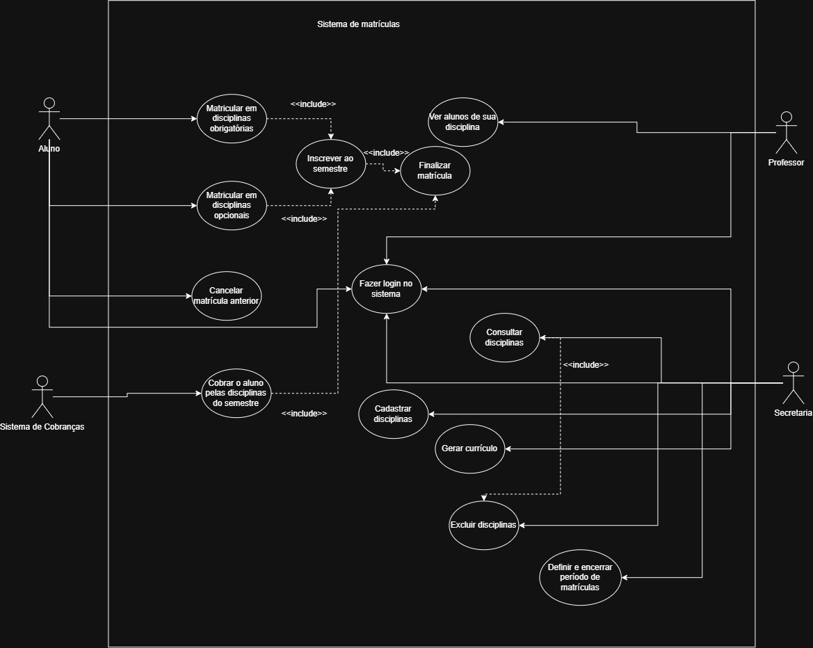

# Sistema de Matrículas

Repositório do laboratório de Projeto de Software (PUC Minas) referente ao enunciado `LABORATORIO_2_LAB_DESENVOLVIMENTO_DE_SOFTWARE`.

## Diagrama de Casos de Uso

Atores: **Aluno**, **Professor**, **Secretaria** e **Sistema de Cobranças**.

| Ator | Casos de uso |
| --- | --- |
| Aluno | Fazer login no sistema; Matricular em disciplinas obrigatórias; Matricular em disciplinas opcionais; Cancelar matrícula anterior |
| Professor | Fazer login no sistema; Ver alunos de sua disciplina |
| Secretaria | Fazer login no sistema; Consultar disciplinas; Cadastrar disciplinas; Excluir disciplinas; Gerar currículo; Definir e encerrar período de matrículas |
| Sistema de Cobranças | Cobrar o aluno pelas disciplinas do semestre |

Relações `<<include>>`:

- **Matricular em disciplinas obrigatórias** inclui **Inscrever ao semestre**
- **Matricular em disciplinas opcionais** inclui **Inscrever ao semestre**
- **Inscrever ao semestre** inclui **Finalizar matrícula**
- **Finalizar matrícula** inclui **Cobrar o aluno pelas disciplinas do semestre**
- **Cadastrar disciplinas**, **Gerar currículo** e **Excluir disciplinas** incluem **Consultar disciplinas**

## Histórias de Usuário

### HU01 — Fazer login no sistema

**Como** aluno, professor ou secretaria  
**eu quero** fazer login com usuário e senha  
**para** acessar as funcionalidades do meu perfil.

**Critérios de aceitação:**
- Todo usuário do sistema possui senha utilizada na validação do login.
- O acesso só é liberado após a autenticação.
- Credenciais inválidas impedem a entrada.

---

### HU02 — Matricular em disciplinas obrigatórias

**Como** aluno  
**eu quero** me matricular em disciplinas obrigatórias (1ª opção)  
**para** montar a parte obrigatória da minha grade no semestre.

**Critérios de aceitação:**
- Só é possível matricular durante o período de matrículas.
- O aluno pode se matricular em até **4 disciplinas obrigatórias**.
- Não é permitido matricular-se duas vezes na mesma disciplina.
- Se a disciplina atingir **60 alunos**, as inscrições nela são encerradas.
- Este caso de uso **inclui** Inscrever ao semestre.

---

### HU03 — Matricular em disciplinas opcionais

**Como** aluno  
**eu quero** me matricular em disciplinas opcionais (alternativas)  
**para** completar minha grade com até duas opções extras.

**Critérios de aceitação:**
- Só é possível matricular durante o período de matrículas.
- O aluno pode se matricular em até **2 disciplinas opcionais**.
- Não é permitido matricular-se duas vezes na mesma disciplina.
- Se a disciplina atingir **60 alunos**, as inscrições nela são encerradas.
- Este caso de uso **inclui** Inscrever ao semestre.

---

### HU04 — Cancelar matrícula anterior

**Como** aluno  
**eu quero** cancelar uma matrícula feita anteriormente  
**para** ajustar minha grade enquanto o período estiver aberto.

**Critérios de aceitação:**
- O cancelamento só ocorre dentro do período de matrículas.
- Após o cancelamento, a vaga volta a ficar disponível na disciplina.
- O aluno pode escolher outra disciplina no lugar, respeitando os limites de 4 obrigatórias e 2 opcionais.

---

### HU05 — Inscrever ao semestre

**Como** aluno  
**eu quero** inscrever-me no semestre com as disciplinas escolhidas  
**para** consolidar minha grade daquele período.

**Critérios de aceitação:**
- A inscrição reúne as matrículas obrigatórias e opcionais do aluno no semestre.
- É disparada a partir de Matricular em disciplinas obrigatórias e de Matricular em disciplinas opcionais (`<<include>>`).
- Este caso de uso **inclui** Finalizar matrícula.

---

### HU06 — Finalizar matrícula

**Como** aluno  
**eu quero** finalizar a matrícula do semestre  
**para** confirmar a inscrição e seguir para a cobrança.

**Critérios de aceitação:**
- A finalização ocorre após a inscrição ao semestre (`<<include>>`).
- As disciplinas confirmadas ficam registradas para o semestre.
- Este caso de uso **inclui** Cobrar o aluno pelas disciplinas do semestre.

---

### HU07 — Cobrar o aluno pelas disciplinas do semestre

**Como** Sistema de Cobranças  
**eu quero** ser notificado com as disciplinas do aluno no semestre  
**para** cobrar o aluno pelas disciplinas daquele período.

**Critérios de aceitação:**
- A cobrança é incluída ao finalizar a matrícula (`<<include>>`).
- A notificação contém o aluno e as disciplinas inscritas naquele semestre.
- O Sistema de Cobranças é o ator externo responsável por essa cobrança.

---

### HU08 — Ver alunos de sua disciplina

**Como** professor  
**eu quero** ver os alunos matriculados em cada disciplina que ministro  
**para** acompanhar a turma do semestre.

**Critérios de aceitação:**
- O professor precisa estar autenticado.
- A consulta mostra os alunos com matrícula ativa na disciplina.
- Alunos que cancelaram a matrícula não aparecem na lista.

---

### HU09 — Consultar disciplinas

**Como** secretaria  
**eu quero** consultar as disciplinas cadastradas  
**para** apoiar o cadastro, a exclusão e a geração do currículo.

**Critérios de aceitação:**
- É possível listar e localizar disciplinas do sistema.
- Cadastrar disciplinas, Excluir disciplinas e Gerar currículo **incluem** esta consulta (`<<include>>`).

---

### HU10 — Cadastrar disciplinas

**Como** secretaria  
**eu quero** cadastrar disciplinas  
**para** manter a oferta acadêmica atualizada.

**Critérios de aceitação:**
- A secretaria informa os dados da disciplina (incluindo sua relação com o curso).
- A disciplina cadastrada fica disponível para consulta e para o currículo do semestre.
- Este caso de uso **inclui** Consultar disciplinas.

---

### HU11 — Gerar currículo

**Como** secretaria  
**eu quero** gerar o currículo de cada semestre  
**para** definir quais disciplinas serão ofertadas naquele período.

**Critérios de aceitação:**
- A secretaria seleciona o semestre e as disciplinas que farão parte do currículo.
- Cada curso tem nome, número de créditos e é constituído por diversas disciplinas.
- Este caso de uso **inclui** Consultar disciplinas.

---

### HU12 — Excluir disciplinas

**Como** secretaria  
**eu quero** excluir disciplinas  
**para** remover da base as que não devem mais ser ofertadas.

**Critérios de aceitação:**
- A secretaria identifica a disciplina a ser excluída.
- A disciplina deixará de aparecer nas consultas e nos currículos futuros.
- Este caso de uso **inclui** Consultar disciplinas.

---

### HU13 — Definir e encerrar período de matrículas

**Como** secretaria  
**eu quero** definir e encerrar o período de matrículas  
**para** controlar quando o aluno pode se matricular ou cancelar, e avaliar as turmas no fim do prazo.

**Critérios de aceitação:**
- O período possui data de início e data de fim.
- Fora desse período, o aluno não consegue matricular-se nem cancelar matrícula.
- Ao encerrar o período, disciplina com **pelo menos 3 alunos** fica **ativa** e ocorrerá no semestre seguinte.
- Disciplina com **menos de 3 alunos** é **cancelada**.

## Diagrama de Classes (Lab01S02)

Fonte para importar no draw.io: `docs/diagrama-classes.puml`.

No [diagrams.net](https://app.diagrams.net): **Arrange → Insert → Advanced → PlantUML**, cole o conteúdo do arquivo e confirme.

O projeto Java está em `src/main/java/br/pucminas/matriculas`, com as mesmas classes, atributos e stubs dos métodos do diagrama. A lógica fica para a Lab01S03.

| Classe | Papel |
| --- | --- |
| `Usuario` | Login e senha. Superclasse de Aluno, Professor e Secretaria |
| `Aluno` | Até 4 obrigatórias e 2 optativas; cancelar; inscrever e finalizar o semestre |
| `Professor` | Lista os alunos com matrícula ativa na disciplina |
| `Secretaria` | Consulta, cadastra e exclui disciplinas; gera currículo; abre e encerra o período |
| `Curso` | Nome, créditos e disciplinas que o constituem |
| `Disciplina` | Até 60 alunos; com 60 as inscrições encerram; no fim do período, ≥ 3 fica ativa e &lt; 3 é cancelada |
| `Matricula` | Vínculo do aluno com a disciplina no semestre (tipo e situação) |
| `Semestre` | Ano e período; gera um currículo e possui um período de matrículas |
| `Curriculo` | Disciplinas ofertadas naquele semestre |
| `PeriodoMatricula` | Data de início, data de fim e encerramento |
| `SistemaCobranca` | Notificado ao finalizar a matrícula, para cobrar o aluno no semestre |

## URL do repositório
https://github.com/Kennykiller36/Sistema-de-Matriculas.git
